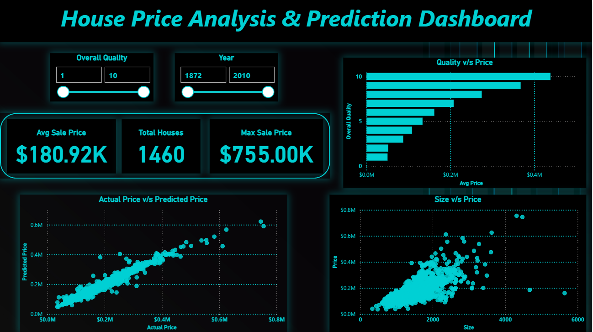
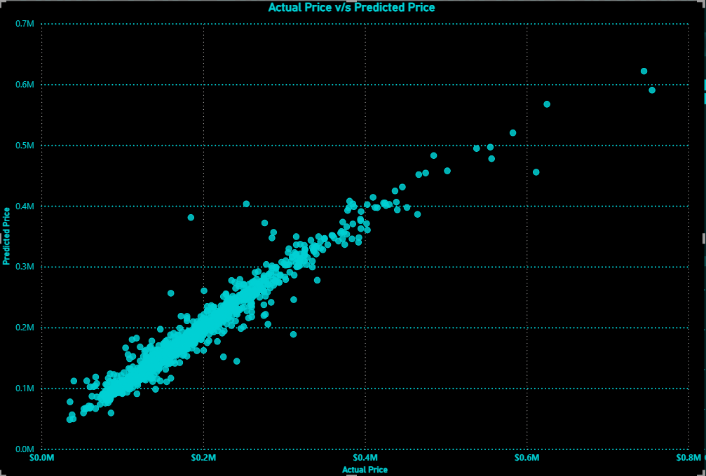

# House-Price-Analysis-Prediction

**Project Overview:**

- End-to-end data analytics and machine learning project to analyze key drivers of house prices and build a predictive model for accurate price estimation.

 **Tech Stack:**

- Python (Pandas, NumPy, Scikit-learn)
- Power BI (Dashboard & Visualization)
- Machine Learning (Random Forest, Linear Regression)

**Key Steps:**

- Data cleaning & missing value handling
- Exploratory Data Analysis (EDA)
- Feature selection based on correlation
- Model building & evaluation
- Prediction generation
- Interactive dashboard creation in Power BI

**Key Insights & Recommendations:**

**1. Construction Quality drives price**

 - Higher OverallQual significantly increases property value
 **Recommendation:** Focus on improving build quality to maximize returns

**2. Living Area has strong positive impact**

 - Larger GrLivArea correlates with higher prices
**Recommendation:** Optimize usable living space in property design

**3. Structural features influence pricing**

 - Garage capacity and basement size contribute to value
 **Recommendation:** Include functional features like parking and storage

**4. Newer properties command higher prices**

 - YearBuilt shows upward pricing trend
 **Recommendation:** Invest in modern construction and renovations

**Dashboard:**

**Machine Learning:**

- Built a regression model to predict house prices based on property features

- Performed feature selection using correlation analysis to retain the most impactful variables such as OverallQual, GrLivArea, and TotalBsmtSF

- Split the data into training and testing sets (80:20) to evaluate model performance on unseen data
Built a Linear Regression model as baseline, achieving moderate performance

- Trained a Random Forest Regressor, which significantly improved results by capturing non-linear relationships and feature interactions

- Final model performance:
 **R² Score: ~0.88**
 **MAE: ~19,485**

- Conducted feature importance analysis, which identified:
  - OverallQual as the most dominant predictor
  - GrLivArea as the second most influential factor

- Evaluated model performance using:
 - Actual vs Predicted comparison

- Generated predictions and integrated results into the Power BI dashboard for visualization and business insights

